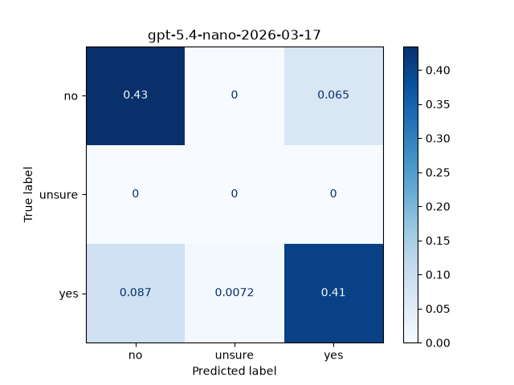
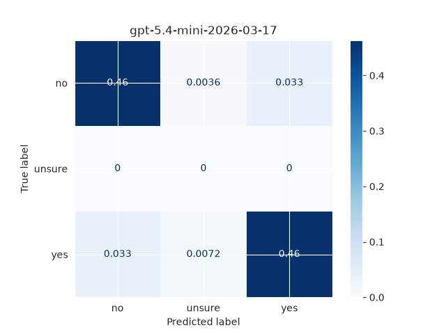
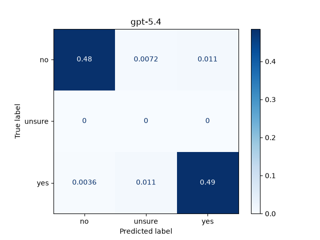
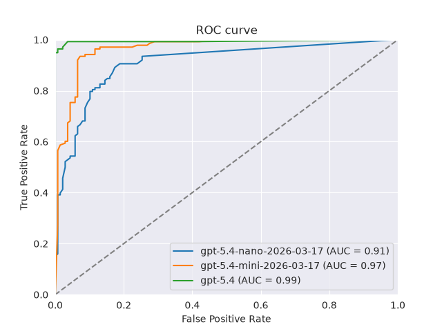

# ISA-LLM

## Overview

LLM have proven an impressive tool in mimicking human linguistic skills. Nonetheless, natural human langauge is charachterized by multiple nuances and inplied meanings, which in linguistics is called "pragmatic meaning". So how do LLMs deal with pragmatic meaning? While I am sure that many have already asked this question, and LLms have bene criticized fornot being always very good at it (REFs), it is important to considr that ISA are difficult to process for humans too (Boux et al. 2023). 

In this small study, I ask **how does LLM comprehension of indirect language (ISA) compare to human performance**. To this purpose, I rely on a set of direct and indirect question reply pairs from my previois work (Boux et al. 2023; Boux et a., ?) and that have been already evaluated by humans. In addition I present teh same question/answer pairs to frontier LLMs and extract their responses.

## Methods 

### Question/answer pair

The question-answer pairs are taken from Boux et al. (2023). They consist of direct/indirect matched pairs, where the same reply can function as direct or indirect language dependong on the preceding question.

- Person A: *"Have you met Martin lately?"* (question)
- Person B: *"I have not seen him for ages."* (direct reply)

and:

- Person A: *"Are you and Martin still good friends?"* (question)
- Person B: *"I have not seen him for ages."* (indirect reply)

### Human data

The human data is also taken from Boux et al. (2023) from the corresponding OSF repository [...]. Briefly, 28 human subjects were presented with the question/answer pairs on a screen and were asked (among others) to evaluate on a 7-points likert scale how much the reply could be understood as a NO (1) or a YES (7). Intermediary integers were also possible so using the value (4) indicated thet the subject was completely unsure.

### LLM data

A set of frontier LLMs (currently `gpt-5.4-nano`, `gpt-5.4-mini`, `gpt-5.4` - inclusion of further open and proprietary models is planned) is selected for this experiment.

All models are queried with the same exact parameters, currently via the **openAI api** and instructed to provided a structured .json output:
* identical system prompt
* `temperature=0`
* identical quation/answer pairs
* identical structure for the json output

The .json output includes:
* **score**: an integer value between 1 and 7, reflecting whether th emodel understands the answer as no (1) or yes (7) along an integer continuum;
* **rationale**, a concise justification for thithe scores.

The entire question/answer set is presented to each model 28 times, reflecting the number of human particiapants in the original human study. So each question/answer pairs receives 28 scores *per model*. This is to capture the fact hat, despite `temperature=0`, the  same model sometimes produces a slightly different output. In a forst preprocessing step, for each model and question/reply pair, all 28 scores were averaged, resulting in one score / model / question-reply pair.

## Results

### Classification (accuracy, confusion matrix, ROC curve)

The score (1-7) for humans and models was converted to a categorical value with 3 classes:
* when `score < 4` then `evaluation = 'no'`
* when `score == 4` then `evaluation = 'unsure'`
* when `score > 4` then `evaluation = 'yes'` 

Using the human evaluation as ground-truth, I calculated accuracy for each model. [TABLE WITH ACCURACY VALUES], indicating that `gpt-5.4` had a superior accuracy. 

A closer look at the **confusion matrix** confirms this insight, showing also that none of th emodel displays a clear bias towards misclassifying "yes" as "no" and vice versa, as evidenced by the camparabel size of false positives and false negatives. "unsure" model responses are very rare (after averaging across 28 runs) and overall negligible.

    
    
    
    <em> [Figure 2]: Normalized confusion matrix for the tested models, in a 3-class classification and using human responses as ground truth.</em>

The previous accuracy analysis is based on the fact that, as per instruction used in the system prompt, the models use the score value 4 as the decision threshold. But what if the models still captured the no-yes inference continuum, but with the threshold of 4 is just not the right one? The **ROC-curve** and the **ROC-AUC** value show that all models seem to capture the yes-no continuum in a way that is resonamly close to human processing. Once again, `gpt-5.4` scores best. 

### Certainty

The score (1-7) is processed to become a certainty score, such that more extreme values (1 and 7) indicate higher certainty towards either NO or YES and intermediate values (2, 3, 5, 6) indicte less certainty whereas 4  idnicates full uncertainty. The certainty score ranged from 1-4.

## Conclusion

> 

## Tech stack

Python:
* `numpy` and `pandas`
* `openAI`
* `seaborn` and `matplotlib`
* `pydantic`
* `scikit-learn`

## Future work

TO DO in `collect_data.ipynb`
- [x] shorten qas (as a function argument)
- [x] added clipping to import
- [x] added extraction of rationale
- [x] revised system prompt
- [ ] (integrate reasoning degree?) 
- [x] (integrate temperature?)
- [x] loop over models
- [x] loop over several "repetititons" for each model
- [ ] change API so that it is compatible with all models of interest (incl. large open models ideally)
- [x] change system prompt so that the scores are on a 7-1 scale to max comparability with human data.
- [x] let repetitions match the number of subjects in the human study

TO DO in `analyse.ipynb`:
- [x] import human data
- [x] add condiiton / set information and run analysi s by condition and set
- [ ] save figures
- [ ] generate summary stats and save them

