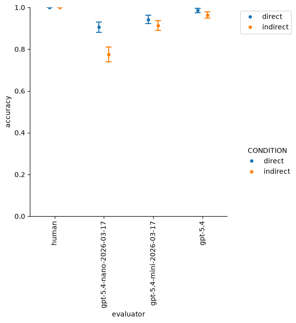
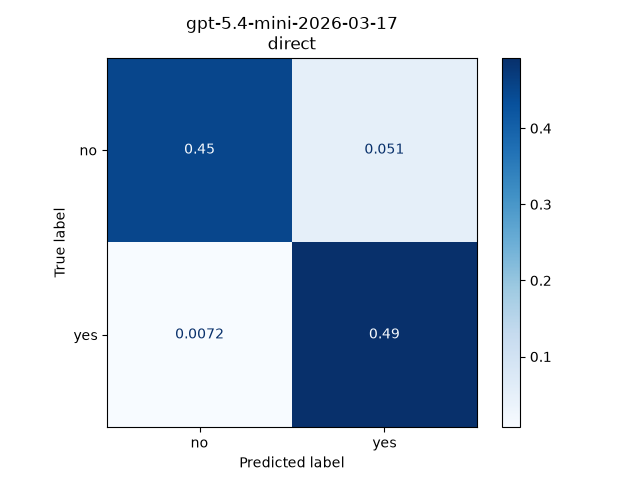
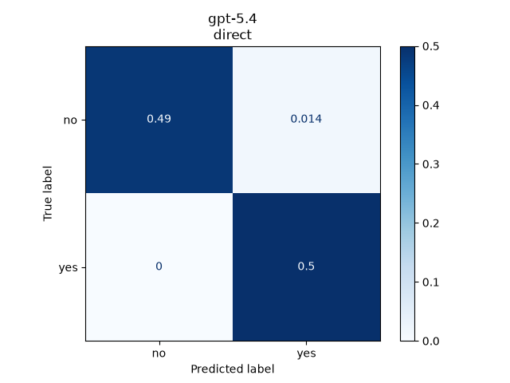
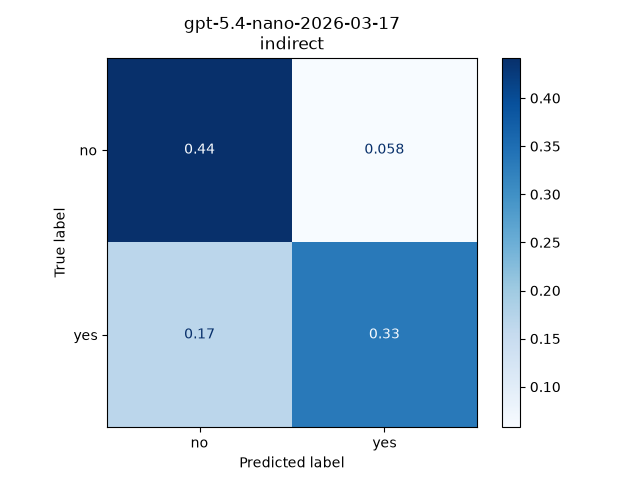
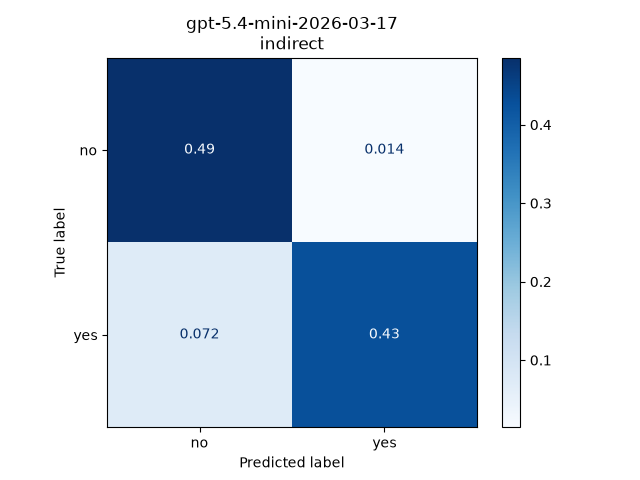
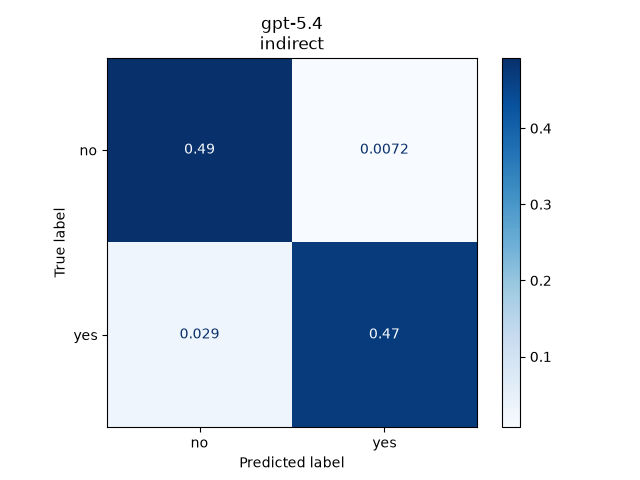
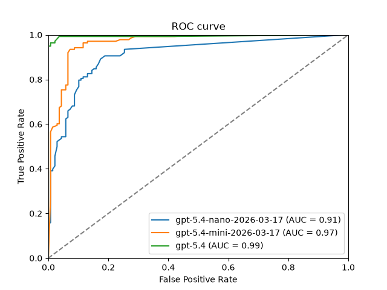
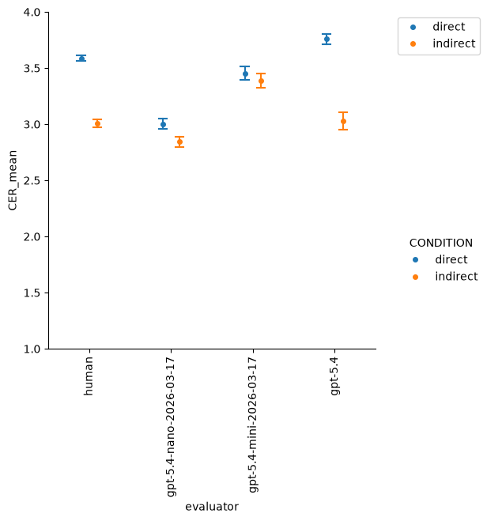

# How do LLMs and humans compare in processing indirect speech?

## Overview

LLMs have proven to be impressive tools for mimicking human linguistic skills. Nonetheless, natural human language is characterized by multiple nuances and implied meanings, which can be referred to as "pragmatic meaning." So how do LLMs deal with pragmatic meaning? While I am sure that many have already asked this question, and LLMs have been criticized for not always being very good at it (REFs), it is important to consider that ISAs are difficult for humans to process too (Boux et al. 2023).

In this small study, I ask **how LLM comprehension of indirect language (ISA) compares to human performance**. To do so, I rely on a set of direct and indirect question/reply pairs from my previous work (Boux et al. 2023; Boux et al., ?) that have already been evaluated by humans. In addition, I present the same question/reply pairs to frontier LLMs and extract their responses.

## Methods 

### Question/reply pair

The question/reply pairs are taken from Boux et al. (2023). They consist of direct/indirect matched pairs, where the same reply can function as direct or indirect language depending on the preceding question.

- Person A: *"Have you met Martin lately?"* (question)
- Person B: *"I have not seen him for ages."* (direct reply)

and:

- Person A: *"Are you and Martin still good friends?"* (question)
- Person B: *"I have not seen him for ages."* (indirect reply)

### Human data

The human data is also taken from Boux et al. (2023), from the corresponding OSF repository [...]. Briefly, 28 human participants were presented with the question/reply pairs on a screen and were asked, among other things, to evaluate on a 7-point Likert scale how much the reply could be understood as a NO (1) or a YES (7). Intermediate integers were also possible, so using the value 4 indicated that the participant was completely unsure.

### LLM data

A set of frontier LLMs is selected for this experiment (currently `gpt-5.4-nano`, `gpt-5.4-mini`, and `gpt-5.4`; inclusion of further open and proprietary models is planned).

All models are queried with exactly the same parameters, currently via the **OpenAI API**, and are instructed to provide a structured JSON output:
* identical system prompt
* `temperature=0`
* identical question/reply pairs
* identical structure for the JSON output

The JSON output includes:
* **score**: an integer value between 1 and 7, reflecting whether the model understands the reply as no (1) or yes (7) along an integer continuum;
* **rationale**: a concise justification for this score.

The entire question/reply set is presented to each model 28 times, reflecting the number of human participants in the original human study. Thus, each question/reply pair receives 28 scores *per model*. This is to capture the fact that, despite `temperature=0`, the same model sometimes produces a slightly different output. In a first preprocessing step, for each model and question/reply pair, all 28 scores were averaged, resulting in one score per model per question/reply pair.

## Results

### Classification (accuracy, confusion matrix, ROC curve)

The score (1-7) for humans and models was converted to a binary value:
* when `score <= 4` then `evaluation = 'no'`
* when `score > 4` then `evaluation = 'yes'` 

Using the human evaluation as ground truth, I calculated accuracy for each model. As visible in Figure 1, all models underperformed relative to humans overall, regardless of (in)directness. However, all models did worse at matching human performance for indirect than for direct question/reply pairs. Overall, the models ranked as follows in their general performance: `gpt-5.4-nano` < `gpt-5.4-mini` < `gpt-5.4`.

    
    
<em>[Figure 1]: Accuracy of each model as a function of (in)directness. Human performance is considered ground truth (and therefore is equal to 1). Error bars show the standard error of the mean (SE).</em>

A closer look at the **confusion matrix** confirms this insight. In addition, it shows that the smaller `gpt-5.4-nano` and `gpt-5.4-mini` models tend to misclassify "yes" as "no" and vice versa, as evidenced by the comparable sizes of false positives and false negatives. "Unsure" model responses are very rare after averaging across 28 runs and are overall negligible.

    
    
    
     
    
    
    
     
    <em>[Figure 2]: Normalized confusion matrix for each model, separately for direct (upper row) and indirect replies (bottom row), in a binary classification using human responses as ground truth.</em>

The previous accuracy analysis is based on the fact that, as specified in the system prompt, the models use the score value 4 as the decision threshold. But what if the models still capture the no/yes inference continuum, and the threshold of 4 is simply not the right one? The **ROC curve** and the **ROC-AUC** value show that all models seem to capture the yes/no continuum in a way that is reasonably close to human processing. Once again, `gpt-5.4` scores best, with an AUC of 0.99.

    
    
<em>[Figure 3]: ROC curve for all models, evaluated simultaneously on direct and indirect replies.</em>

### Certainty

So far, we have looked at categorical responses (NO/YES) derived from a continuous scale (1-7) with a threshold set at 4. Looking only at categorized responses, however, might hide subtler patterns in the data, for instance how certain (i.e., confident) humans or LLMs are in their responses.

A certainty score is obtained by transforming the original score (1-7) provided by the LLMs such that more extreme values (1 and 7) indicate higher certainty toward either NO or YES, while intermediate values (2, 3, 5, 6) indicate less certainty and 4 indicates full uncertainty. The certainty score ranges from 1 to 4.

Humans tend to be less certain of their interpretations when they process indirect replies compared to direct replies. Interestingly, the smaller models `gpt-5.4-nano` and `gpt-5.4-mini` do not replicate this pattern and achieve comparable certainty for both reply types. This is not the case for `gpt-5.4`, which achieves certainty comparable to humans, including the direct/indirect dissociation.

    
    
<em>[Figure 4]: Certainty scores obtained for direct and indirect replies for both human and LLM evaluators. Error bars indicate standard error of the mean (sem).</em>

## Conclusion

> Different models (`gpt-5.4-nano`, `gpt-5.4-mini`, `gpt-5.4`) performed differently when compared to human performance in understanding direct and indirect speech acts.
Overall, a gradient could be observed such that the largest model, `gpt-5.4`, was the best overall at matching human performance. Specifically, it achieved the highest accuracy and did not show a preference for mistaking "yes" for "no." In addition, similar to humans, this model was less certain in response to indirect than to direct answers.
While `gpt-5.4` clearly performed closest to humans among the three evaluated models, other open or proprietary models from other providers should be evaluated to provide a more complete understanding of LLM performance on indirect speech.

## Tech stack

Python:
* `numpy` and `pandas` for data manipulation
* `OpenAI` for gathering the data from LLMs
* `seaborn` and `matplotlib`
* `pydantic` for enforcing a JSON data schema as LLM output
* `scikit-learn` for classification metrics
* `pingouin` for inferential statistics

## Future work

TO DO in `collect_data.ipynb`:
- [ ] change API so that it is compatible with all models of interest (incl. large open models ideally)

TO DO in `analyse.ipynb`:
- [ ] FOOD FOR THOUGHT: if any inferential statistics are conducted, it could be more appropriate to conduct them by subject (or run) rather than by item to maximize comparability to human data. This however would require using individual human subject data, which participants did not consent to share. Not possible unless those data are not synced to git.

