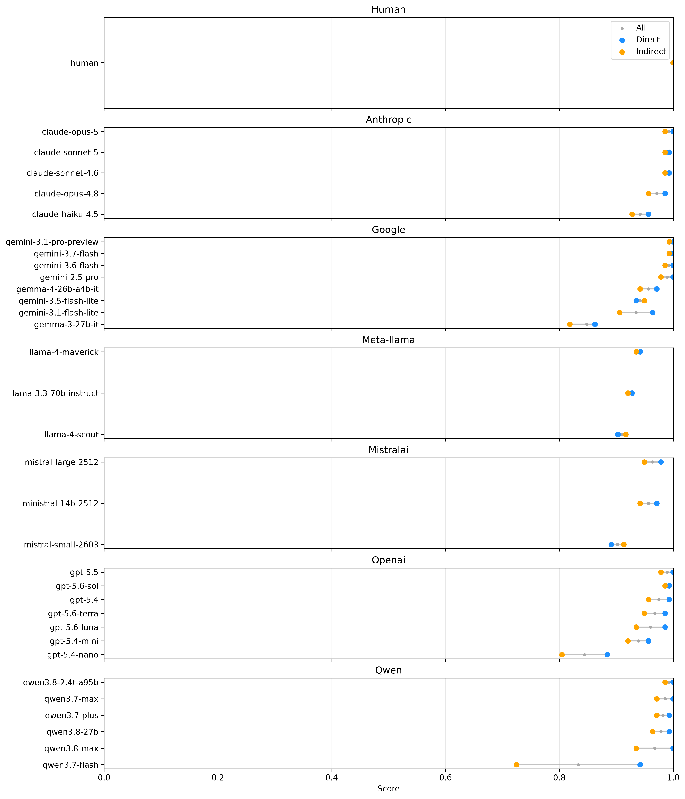
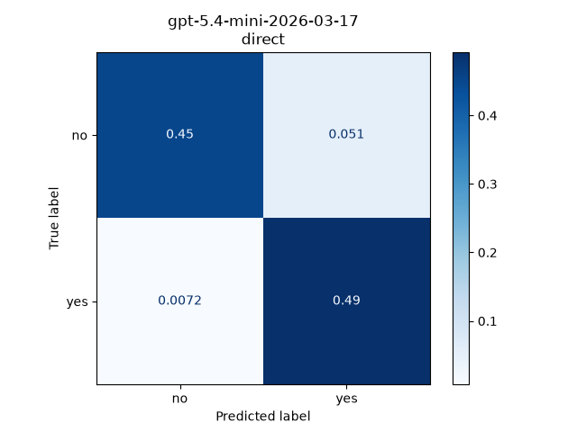
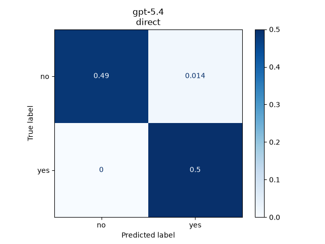
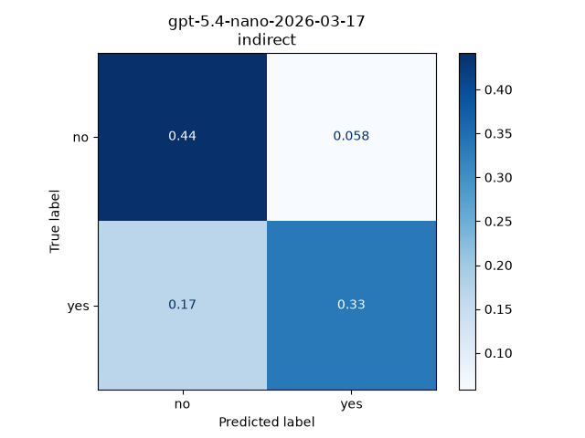
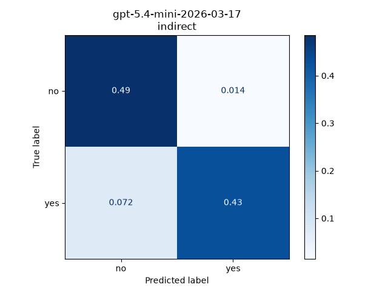
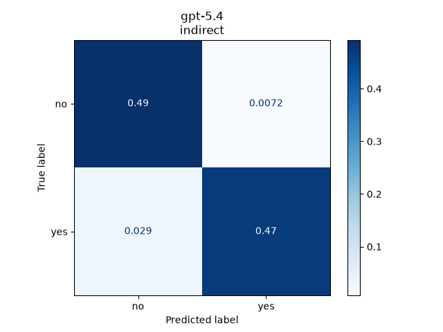
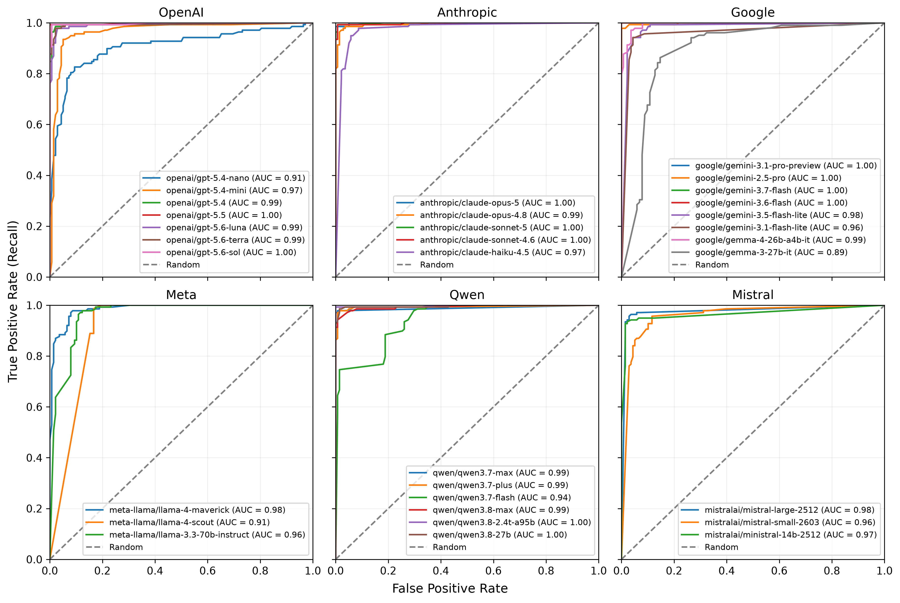
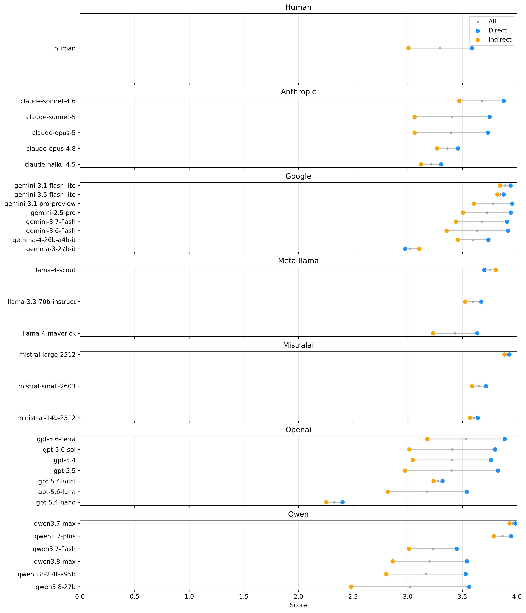

# How do LLMs and humans compare when processing indirect speech?

## Overview

LLMs have proven to be impressive tools for mimicking human linguistic skills. Nonetheless, natural human language is characterized by many nuances and indirect meanings. For instance, if someone is asked *"Would you like a piece of cake?"*, the answer *"I am on a diet"* would indirectly mean NO and would constitute a so-called **indirect speech act (ISA)** (Grice, 1975; Searle, 1979).

So how do LLMs deal with indirect speech acts? Although it is important to consider that ISAs are also difficult for humans to process (Boux et al., 2023a, 2023b), LLMs have so far been found to perform worse than humans (Orsini & Brunato, n.d.; Koo et al., 2025; Solidjonov, 2026). However:

- the methodologies used in these studies vary (see Ma et al., 2025, and Sadigzada, 2026, for discussions);
- direct comparisons with human performance are not always provided; and
- newer models have not been evaluated.

> In this study, I ask **how cutting-edge LLMs' comprehension of indirect language (ISAs) compares with human performance**. To do so, I rely on a set of direct and indirect question/reply pairs from my previous work (Boux et al., 2023a; Boux & Pulvermüller, 2023b). These pairs have already been evaluated by humans, who provided quantitative ratings. I present the same question/reply pairs to frontier LLMs, extract their responses, and compare them with the human responses.

## Methods 

### Question/reply pairs

The question/reply pairs are taken from Boux et al. (2023). They consist of matched direct/indirect pairs in which the same reply can function as direct or indirect language depending on the preceding question.

- Person A: *"Have you met Martin lately?"* (question)
- Person B: *"I have not seen him for ages."* (direct reply)

and:

- Person A: *"Are you and Martin still good friends?"* (question)
- Person B: *"I have not seen him for ages."* (indirect reply)

### Human data

The human data are also taken from Boux et al. (2023) and the corresponding OSF open repository (https://doi.org/10.17605/OSF.IO/B9YEU). Briefly, 28 human participants were presented with the question/reply pairs on a screen and were asked, among other things, to rate on a 7-point Likert scale the extent to which each reply could be understood as a NO (1) or a YES (7). Intermediate integer ratings were also possible, with a rating of 4 indicating that the participant was completely unsure.

### LLM data

A set of frontier LLMs is selected for this experiment.

| Provider | Model name | Model type | Comment |
|---|---|---|---|
| OpenAI | `gpt-5.4-nano` | Closed weight | — |
|  | `gpt-5.4-mini` | Closed weight | — |
|  | `gpt-5.4` | Closed weight | — |
|  | `gpt-5.5` | Closed weight | — |
|  | `gpt-5.6-luna` | Closed weight | — |
|  | `gpt-5.6-terra` | Closed weight | — |
|  | `gpt-5.6-sol` | Closed weight | — |
| Anthropic | `claude-opus-5` | Closed weight | — |
|  | `claude-opus-4.8` | Closed weight | — |
|  | `claude-sonnet-5` | Closed weight | — |
|  | `claude-sonnet-4.6` | Closed weight | — |
|  | `claude-haiku-4.5` | Closed weight | — |
| Google | `gemini-3.1-pro-preview` | Closed weight | — |
|  | `gemini-2.5-pro` | Closed weight | — |
|  | `gemini-3.7-flash` | Closed weight | — |
|  | `gemini-3.6-flash` | Closed weight | — |
|  | `gemini-3.5-flash-lite` | Closed weight | — |
|  | `gemini-3.1-flash-lite` | Closed weight | — |
|  | `gemma-4-26b-a4b-it` | Open weight | — |
|  | `gemma-4-31b-it` | Open weight | Does not support JSON output |
|  | `gemma-3-27b-it` | Open weight | — |
|  | `gemma-3-12b-it` | Open weight | Data was collected only for direct responses, for unknown reasons |
|  | `gemma-3-4b-it` | Open weight | Data was not collected for unknown reasons |
| Meta | `llama-4-maverick` | Open weight | — |
|  | `llama-4-scout` | Open weight | — |
|  | `llama-3.3-70b-instruct` | Open weight | — |
| Qwen | `qwen3.7-max` | Closed weight | — |
|  | `qwen3.7-plus` | Closed weight | — |
|  | `qwen3.7-flash` | Closed weight | — |
|  | `qwen3.8-max` | Closed weight | — |
|  | `qwen3.8-2.4t-a95b` | Open weight | — |
|  | `qwen3.8-27b` | Open weight | — |
| Mistral AI | `mistral-large-2512` | Open weight | — |
|  | `mistral-small-2603` | Open weight | — |
|  | `ministral-14b-2512` | Open weight | — |

All models are queried with exactly the same parameters, currently via the **OpenAI API**, and are instructed to provide structured JSON output:

* an identical system prompt;
* `temperature=0`;
* identical question/reply pairs; and
* an identical JSON output structure.

The JSON output includes:

* **score**: an integer value between 1 and 7, reflecting whether the model understands the reply as no (1) or yes (7) along an integer continuum;
* **rationale**: a concise justification for this score.

The entire set of question/reply pairs is presented to each model 14 times. Originally, 28 presentations/model were planned to reflect the number of human participants in the original human study. However, this was reduced to 14 to reduce costs. Thus, each question/reply pair receives 14 scores *per model*. This captures the fact that, despite `temperature=0`, the same model sometimes produces slightly different output. In an initial preprocessing step, all 28 scores for each model and question/reply pair were averaged, resulting in one score per model per question/reply pair.

## Results

### Classification (accuracy, ROC curve)

The scores (1–7) for humans and models were converted to binary values:

* when `score <= 4`, then `evaluation = 'no'`;
* when `score > 4`, then `evaluation = 'yes'`.

Using the human evaluations as ground truth, I calculated the accuracy of each model. As shown in Figure 1, all models slightly underperformed relative to humans. Moreover, all models matched human performance less accurately for indirect question/reply pairs than for direct ones.

When considering accuracy for both direct and indirect replies, the best-performing models were:

| Rank | Provider | Model | Direct | Indirect | Direct + Indirect |
|---|---|---|---|---|---|
| 1 | google | gemini-3.7-flash |1.000 | 0.993 | 0.996
| 2 | google | gemini-3.1-pro-preview |1.000 | 0.993 |0.996
| 3 | google | gemini-3.6-flash | 1.000 | 0.986 |0.993

The best-performing open-weight models were:

| Rank | Provider | Model | Direct | Indirect | Direct + Indirect |
|---|---|---|---|---|---|
| 1 | qwen | qwen3.8-2.4t-a95b | 1.000 | 0.986 | 0.993
| 2 | qwen | qwen3.8-27b | 0.993 |0.964 | 0.978
| 3 | mistralai | mistral-large-2512 | 0.978 | 0.949 | 0.964

    
    
<em>[Figure 1]: Accuracy of each model for direct (blue) and indirect (orange) replies, separated by model provider. Human performance is taken as the ground truth and is therefore equal to 1.</em>

<!-- A closer look at the **confusion matrix** confirms this insight. In addition, it shows that the smaller `gpt-5.4-nano` and `gpt-5.4-mini` models tend to misclassify "yes" as "no" and vice versa, as evidenced by the comparable sizes of false positives and false negatives. "Unsure" model responses are very rare after averaging across 28 runs and are overall negligible.

    
    
    
     
    
    
    
     
    <em>[Figure 2]: Normalized confusion matrix for each model, separately for direct (upper row) and indirect replies (bottom row), in a binary classification using human responses as ground truth.</em>

 -->

The preceding accuracy analysis is based on the fact that, as specified in the system prompt, the models use a score of 4 as the threshold for a binary decision. But what if the models still capture the NO/YES inference continuum and 4 is simply not the appropriate threshold? The **ROC curves** and **ROC-AUC scores** show that all models appear to capture the NO/YES continuum in a way that is reasonably close to human processing (Figure 2).

    
    
<em>[Figure 2]: ROC curves for all models, evaluated on direct and indirect replies simultaneously and separated by provider.</em>

When considering ROC-AUC for both direct and indirect replies, the best-performing models were:

| Rank | Provider | Model | Direct | Indirect | Direct + Indirect |
|---|---|---|---|---|---|
| 1 | google | gemini-3.7-flash |1.000 | 1.000 | 1.000
| 2 | google | gemini-3.1-pro-preview |1.000 | 1.000 | 1.000
| 3 | google | gemini-3.6-flash | 1.000 | 1.000 | 1.000

The best-performing open-weight models were:

| Rank | Provider | Model | Direct | Indirect | Direct + Indirect |
|---|---|---|---|---|---|
| 1 | qwen | qwen3.8-2.4t-a95b | 1.000 | 0.991 | 0.997
| 2 | qwen | qwen3.8-27b |1.000 | 0.986| 0.996
| 3 | google | gemma-4-26b-a4b-it | 0.997 | 0.991 | 0.995

### Certainty

So far, we have examined categorical responses (NO/YES) derived from a continuous scale (1–7), with a threshold set at 4. Looking only at categorized responses, however, might hide subtler patterns in the data, such as how certain (i.e., confident) humans or LLMs are in their responses.

A certainty score is obtained by transforming the original score (1–7) provided by the LLMs so that the extreme values (1 and 7) indicate greater certainty toward either NO or YES, while the intermediate values (2, 3, 5, and 6) indicate less certainty and 4 indicates complete uncertainty. The certainty score ranges from 1 to 4.

Compared with humans, most LLMs were generally more confident when interpreting replies, regardless of their directness. However, like humans, most LLMs tended to be less confident when interpreting indirect replies than direct replies.

    
    
<em>[Figure 3]: Certainty scores for direct and indirect replies from both human and LLM evaluators, reported separately for each provider (SEM).</em>

Overall, based on visual inspection, one model, `qwen_qwen3.7-flash`, seems to mimic human certainty most closely. One *preliminary* approach to identifying models that differ (or do not differ) from human behavior is to use inferential statistics. The responses of each model were compared individually with the human data using a mixed ANOVA with the following factors:

- Between-subjects factor: condition (direct/indirect)
- Within-subjects factor: evaluator (human/model)

Certainty ratings are expected to vary across conditions (a main effect of *condition*). However, if a model behaves similarly to humans, neither the main effect of *evaluator* nor the interaction between *evaluator* and *condition* should be significant.

The model `qwen_qwen3.7-flash` was the only one to exhibit this pattern of significance and non-significance.

| Factor                      | SS     | DF1 | DF2 | MS     | F      | p      |
|-----------------------------|--------|-----|-----|--------|--------|--------|
| Condition (direct/indirect) | 35.674 | 1   | 274 | 35.674 | 87.917 | < .001 |
| Evaluator (human/model)     | 0.644  | 1   | 274 | 0.644  | 2.760  | .098   |
| Condition × evaluator       | 0.713  | 1   | 274 | 0.713  | 3.054  | .082   |

## Conclusion

> Current LLMs interpret indirect speech acts with high accuracy, although they perform slightly worse on indirect than on direct replies and are generally more confident than humans. For the most human-like **overall performance**, choose the closed-weight `gemini-3.7-flash`. For an open-weight alternative, choose `qwen3.8-2.4t-a95b`; however, the smaller `qwen3.8-27b` also performs well and may be more practical to deploy. If matching human **certainty** is the main priority, `qwen3.7-flash` appears to be the closest fit.

## Limitations

**Differences in certainty**. The inferential analysis compared each model individually with human certainty ratings using a separate mixed ANOVA. Because no correction for multiple comparisons was applied, the probability of false-positive findings increases across the large number of models tested. Furthermore, nonsignificant effects of evaluator or its interaction with condition cannot be interpreted as evidence that model and human behavior are equivalent; therefore, the apparent similarity of `qwen3.7-flash` to humans should be considered exploratory.

**Human performace as ground truth**. In general, it is difficult to define what it means to be good at understanding indirect speech acts and what constitutes ground truth. If ground truth exists at all, it might be the intention of the person who produced the indirect reply. In the present work, LLM performance was compared with human performance; therefore, the study merely addresses the question of which LLMs tend to behave most similarly to humans, regardless of any imperfections in human performance.

**Meta-linguistc judgements**. As in the human study (Boux et al., 2023), the LLMs were asked to rate on a 7-point Likert scale whether a reply could be understood as "YES" or "NO," with the middle value indicating uncertainty or ambiguity. This assessment method has limitations. In particular, it does not correspond to how people and LLMs process speech under natural circumstances, in which a rating is typically unnecessary and only an appropriate response is required. One way to address this issue would be to send indirect requests to agents based on different LLMs and assess the likelihood that each LLM calls the relevant tool.

## Tech stack

Python:

* `numpy` and `pandas` for data manipulation
* `OpenRouter` for gathering the data from LLMs
* `openai` as API client to access OpenRouter
* `requests` for metadata API requests
* `seaborn` and `matplotlib` for data visualization
* `pydantic` for enforcing a JSON schema for LLM output
* `scikit-learn` for classification metrics
* `pingouin` for inferential statistics
* `logging` for runtime event logging

## References

* Boux, I., Margiotoudi, K., Dreyer, F., Tomasello, R., & Pulvermüller, F. (2023a). Cognitive Features of Indirect Speech Acts. Language, Cognition and Neuroscience, 38(1), 40–64. https://doi.org/10.1080/23273798.2022.2077396

* Boux, I., & Pulvermüller, F. (2023b). Does the right temporo-parietal junction play a role in processing indirect speech acts? A transcranial magnetic stimulation study. Neuropsychologia, 188, 108588. https://doi.org/10.1016/j.neuropsychologia.2023.108588

* Grice, P. (1975). Logic and Conversation. Syntax and Semantics, 3, 41–58. https://doi.org/10.1111/j.1365-2664.2006.01229.x

* Koo, Y., Lee, J., Park, D., Park, S., & Lee, S. (2025). Evaluating Large language models on Understanding Korean indirect Speech acts (arXiv:2502.10995). arXiv. https://doi.org/10.48550/arXiv.2502.10995

* Ma, B., Li, Y., Zhou, W., Gong, Z., Liu, Y. J., Jasinskaja, K., Friedrich, A., Hirschberg, J., Kreuter, F., & Plank, B. (2025). Pragmatics in the Era of Large Language Models: A Survey on Datasets, Evaluation, Opportunities and Challenges. In W. Che, J. Nabende, E. Shutova, & M. T. Pilehvar (Eds.), Proceedings of the 63rd Annual Meeting of the Association for Computational Linguistics (Volume 1: Long Papers) (pp. 8679–8696). Association for Computational Linguistics. https://doi.org/10.18653/v1/2025.acl-long.425

* Orsini, M., & Brunato, D. (n.d.). Direct and Indirect Interpretations of Speech Acts: Evidence from Human Judgments and Large Language Models.

* Sadigzada, Z. (2026). Pragmatic Failure in Agentic LLM Systems: An Analysis Through Gricean Maxims and Speech Act Theory. Global Spectrum of Research and Humanities, 3(2), 71–84. https://doi.org/10.69760/gsrh.0260302009

* Searle, J. (1979). Expression and Meaning: Studies in the Theories of Speech Acts. Cambridge University Press.

* Solidjonov, D. (2026). Pragmatic competence without embodiment? Evaluating LLM performance on implicature, presupposition, and speech acts. Journal of Cultural Cognitive Science. https://doi.org/10.1007/s41809-026-00200-5

## TO DO

In `collect_data.py`:
- [ ] Further refactor (put functions in a separate file)?
- [ ] Consider randomizing stimulus presentation

TO DO in `analyse.ipynb`:
- [ ] Refactor into .py
- [ ] Add data validation. Check that every code is present and that no unexpected code is included.
- [ ] Rework comparison of human and LLM analysis

